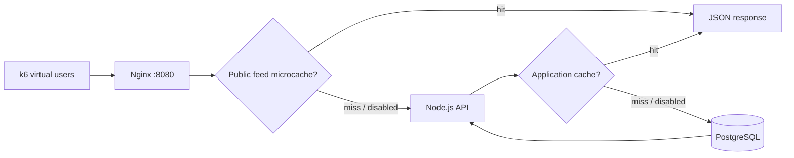

# Single Server Performance Lab

How much work can one server avoid by caching the same public feed?

A standalone experiment comparing three ways to serve a social feed: an indexed database query, a one-second application cache, and a one-second Nginx microcache. Built with **Node.js, PostgreSQL, Nginx, and k6**, the lab shows how moving the cache changes the request path, throughput, latency, and freshness. It includes deterministic seed data, API and PostgreSQL checks, measured results, and a live metrics page.

## The experiment

| Mode | Feed response path | What it demonstrates |
| --- | --- | --- |
| Baseline | Nginx → Node → PostgreSQL on every request | Query and application costs |
| Node cache | Nginx → Node → one-second in-process JSON cache | Lower database traffic; coalesced cache misses |
| Nginx microcache | Nginx → one-second proxy cache; Node on misses | Fewer application requests and serializations |



The comparison holds the workload and target resource limits fixed. Cache hits avoid different amounts of work: the application cache skips the database query, while the proxy cache also skips the Node request handler. Hardware, request mix, think time, and test duration all affect the measured result.

## Quick demo: Node 22+

```bash
git clone https://github.com/rohansikder/single-server-performance.git
cd single-server-performance
npm ci
npm test
npm run demo
```

Open http://localhost:3000. The memory demo lets you inspect the feed and metrics without Docker. It is not a PostgreSQL benchmark.

```bash
DATA_SOURCE=memory MODE=node-cache npm start
```

## Full lab: Docker with Compose

```bash
npm ci
mkdir -p results
docker compose up -d --build
docker compose run --rm app npm run seed
curl http://localhost:8080/health
```

Open http://localhost:8080 for the metrics page. The default seed creates **50,000 users, 500,000 posts, and 2,000,000 likes**. Seeding truncates this lab's data and resets IDs; run it before measurements, never during a test.

For a faster small dataset:

```bash
docker compose run --rm -e SEED_USERS=100 -e SEED_POSTS=1000 -e SEED_LIKES=2000 app npm run seed
```

Set `MAX_USER_ID=100` when load testing that small dataset.

### Compare the three modes

Use the same dataset, virtual user count, duration, and machine for each run. The `k6` service is outside the target CPU/memory limits. Docker Compose sets **1 CPU in total and 2 GiB in total** across the three target services, divided into fixed shares. This is an approximation: it does not reproduce a shared-core cloud VM, its price, disk performance, or scheduler. A separate load-generator machine is recommended for final measurements.

```bash
# 1. Baseline
MODE=baseline NGINX_MODE=baseline docker compose up -d --force-recreate app nginx
VUS=50 DURATION=60s docker compose run --rm --no-deps --user "$(id -u):$(id -g)" k6 run --summary-export=/results/baseline.json /scripts/journey.js

# 2. Node one-second cache
MODE=node-cache NGINX_MODE=baseline docker compose up -d --force-recreate app nginx
VUS=50 DURATION=60s docker compose run --rm --no-deps --user "$(id -u):$(id -g)" k6 run --summary-export=/results/node-cache.json /scripts/journey.js

# 3. Nginx one-second microcache; application cache disabled
MODE=baseline NGINX_MODE=microcache docker compose up -d --force-recreate app nginx
VUS=50 DURATION=60s docker compose run --rm --no-deps --user "$(id -u):$(id -g)" k6 run --summary-export=/results/nginx-cache.json /scripts/journey.js
```

On Windows omit `--user "$(id -u):$(id -g)"` and use your shell's environment-variable syntax. Always apply the matching `MODE` and `NGINX_MODE` when recreating services.

The journey reads the feed, waits 3–7 seconds, opens a post, waits 3–8 seconds, likes with 15% probability, and occasionally creates a post (1%). It models browsing; virtual users are concurrent simulated sessions, not requests per second, registered accounts, or daily active users. Explicit `userId` values model seeded users; authentication is outside this experiment.

To isolate feed throughput without think time, use `/scripts/feed.js` instead of `/scripts/journey.js`. Do not compare the two workloads as if they represented the same traffic.

### Find the capacity boundary

1. Warm up each mode for 30 seconds.
2. Start at 50 VUs, then try 100, 250, 500, 1,000, and higher only while the target remains healthy.
3. Measure each plateau for at least 2–5 minutes. The script defaults to 60 seconds for a quick trial.
4. Require **p95 < 500 ms, p99 < 1,000 ms, and HTTP failures < 1%**. k6 returns a nonzero exit code when thresholds fail.
5. Repeat passing and failing plateaus three times, then refine between them. Report the highest repeatably passing plateau, not the highest VU number attempted.
6. Capture `docker stats`, `/metrics`, host CPU/RAM, generator CPU, hardware, and k6 JSON summaries. Re-seed between comparisons if writes would change the dataset.

See [the benchmark worksheet](docs/benchmark.md) for recording results and [design rationale](docs/design.md) for the cache behavior and tradeoffs.

## API

| Method | Route | Purpose |
| --- | --- | --- |
| GET | `/feed` | Latest 20 posts, public shared feed |
| GET | `/posts/:id` | Read a post |
| POST | `/posts` | Create `{ "userId": 1, "body": "Hello" }` |
| POST | `/posts/:id/like` | Idempotent like `{ "userId": 2 }` |
| GET | `/health` | Database readiness |
| GET | `/metrics` | Per-process counters, RSS, uptime and mode |

```bash
curl -i http://localhost:8080/feed
curl -X POST http://localhost:8080/posts -H 'Content-Type: application/json' -d '{"userId":1,"body":"Cache freshness experiment"}'
```

`X-App-Cache` is HIT, MISS, COALESCED, or BYPASS. `X-Proxy-Cache` appears in microcache mode. On a proxy hit, `X-App-Cache` is the stored upstream header; inspect `X-Proxy-Cache` to determine whether Node ran for that request. Node metrics exclude requests served entirely by Nginx.

## Cache correctness and scope

- Only the shared public feed is cached. No personalized response is stored.
- Node cache entries expire one second after the query completes. Concurrent misses share one query, and failed queries are not cached.
- Writes invalidate the Node cache. A generation guard prevents an in-flight pre-write read from repopulating it.
- Nginx caches successful feed responses for one second and bypasses requests with cookies or Authorization. It has no write invalidation: posts or likes can appear roughly one to two seconds late because Nginx expiry timestamps have whole-second granularity, plus network/query time.
- Node caches are local to one process. Multiple replicas need a different invalidation strategy.
- Like rows have a composite unique key and increment a counter only on first insertion. The feed uses an ordered index and joins authors in one query.

This is a local engineering lab: the Compose password is a disposable example, and writes accept a supplied user ID. Authentication, authorization, rate limiting, TLS, secrets management and production observability would be required for a public service. The bound port is local-only by default.

## Checks and project structure

```bash
npm test
docker compose config --quiet
```

Cache and HTTP tests run locally. PostgreSQL tests run when `TEST_DATABASE_URL` points to an initialized, seeded lab database. GitHub Actions provisions PostgreSQL, seeds a small dataset, runs those integration checks, and validates Compose plus all three running cache configurations.

- `src/`: HTTP API, data adapters, cache
- `db/`: schema and deterministic bulk seed
- `nginx/`: baseline and microcache configuration
- `load/`: realistic journey and feed saturation tests
- `docs/`: live metrics page, methodology and design rationale
- `results/`: local benchmark outputs; ignored until deliberately curated

Docker builds behind a corporate/session proxy can pass an optional CA secret:

```bash
docker build --secret id=proxy_ca,src=/path/to/proxy-ca.pem -t performance-lab .
```

Remove the lab with `docker compose down`. Add `-v` only when you intend to delete the database volume.

## Validation status

All eight API/cache/PostgreSQL tests passed, and all three modes passed short k6 feed checks. See [VALIDATION.md](VALIDATION.md) for checks and measured smoke results. No cloud VM capacity claim is implied by passing unit or integration checks.
