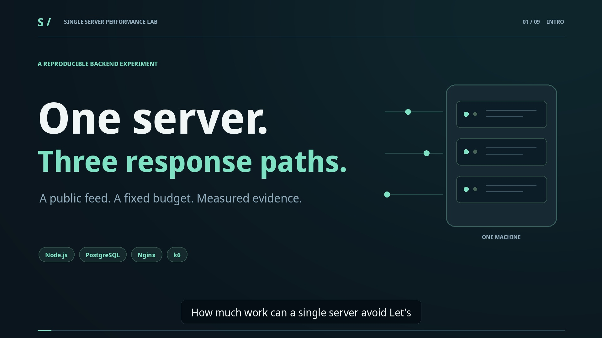

# Walkthrough video

A **2:16** walkthrough with conversational female narration, animated architecture diagrams, measured throughput and latency graphs, and footage of the interactive dashboard.

[Watch or download the MP4](single-server-lab.mp4) · [Transcript](transcript.md) · [English captions](captions.srt)

[](single-server-lab.mp4)

## Chapters

| Start | Chapter |
| --- | --- |
| 00:00 | One server. Three response paths. |
| 00:10 | The experiment |
| 00:27 | Start with a solid baseline. |
| 00:42 | Cache the completed response. |
| 00:58 | Move the cache closer. |
| 01:12 | Measure the work avoided. |
| 01:27 | The median is only half the story. |
| 01:42 | Explore the running lab. |
| 01:57 | Less work. A freshness tradeoff. |

## Open the chaptered player

From the repository root:

```bash
npx --yes http-server@14.1.1 docs/video -a 127.0.0.1 -p 8081 -c-1
```

Open **http://localhost:8081**. The player includes chapter buttons and download links.

## Measurements and production

Recorded graphs use the checked-in PostgreSQL smoke-test summaries: 20 VUs, 15 seconds per feed run, a shared host, and no dedicated warm-up. The live dashboard footage uses the memory demo. These samples do not establish production capacity; both caches had higher p95/p99 latency than baseline.

The video is 1920 × 1080 at 30 fps, encoded as H.264 with AAC audio, English subtitles and burned-in captions. Narration uses the Microsoft Edge TTS Emma voice at normal speed and pitch. The quiet background audio was generated for this walkthrough.
